# 강화학습(DDPG) 기반 벅 컨버터 제어기 설계 및 성능 분석 

## 1. 개요
본 연구에서는 벅 컨버터(Buck Converter)의 정밀한 출력 전압 제어를 위해 DDPG(Deep Deterministic Policy Gradient) 알고리즘을 적용하였다. 

특히 학습 과정에서 발생하는 국소 최적점(Local Minima) 고착화 문제를 해결하고, 정상 상태 오차(Steady-state Error)를 최소화하기 위해 **적분항(Integral term)**과 **진척도(Progress term)**가 결합된 복합 보상 함수(Hybrid Reward Function)를 설계하였다.

## 2.  [Scenario A] 무부하 조건 ($P_{load} = 0W$)

설계 전략강화학습 에이전트의 제어 성능을 결정짓는 핵심 요소인 보상 함수는 다음과 같이 세 가지 요소의 선형 결합으로 구성하였다.
$$R_{total} = R_{error} + R_{integral} + R_{progress}$$

### 2.1. 기본 오차 보상 
($R_{error}$)출력 전압($V_o$)과 목표 전압($V_{ref}$) 간의 오차를 최소화하기 위한 기본항이다. 
오차의 제곱에 비례하는 페널티를 부여하여(Quadratic Penalty), 큰 오차에 대해 더 강력한 피드백을 주도록 설계하였다. 
여기서 $60$은 정규화를 위한 전압 스케일 상수($V_{scale}$)이다.
$$R_{error} = -5.0 \times \left( \frac{\left| V_{ref} - V_o \right|}{60} \right)^2$$

### 2.2. 적분 페널티 및 국소 최적점 탈출 
($R_{integral}$)단순 오차 보상만으로는 에이전트가 목표값 근처의 특정 오차(Offset) 상태에 안주하는 국소 최적점(Local Minima) 문제가 발생할 수 있다. 
이를 해결하기 위해 PID 제어의 적분(Integral) 개념을 도입하였다.

누적 로직: 오차가 허용 범위($V_{tol}=5V$)를 초과할 경우, 적분 변수($E_{int}$)에 오차를 누적시켜 시간이 지날수록 페널티를 기하급수적으로 증가시킨다. 
이는 에이전트가 현 상태에 머무르는 것을 '고통'으로 인식하게 하여 탈출을 유도한다.

Soft Reset (Anti-Windup): 오차가 허용 범위 내로 들어오면 누적값을 즉시 0으로 만들지 않고, 0.9의 감쇠율(Decay rate)을 적용하여 서서히 감소시킨다. 
이는 보상 함수의 급격한 불연속성을 방지하여 학습의 진동(Chattering)을 억제한다. 
(최대 누적 한계 $E_{int,max} = 100$)$$R_{integral} = -2.5 \times \left( \frac{E_{int}}{100} \right)^2$$

### 2.3. 진척도 보상 ($R_{progress}$)
에이전트가 목표를 향해 올바른 방향으로 움직이고 있는지를 판단하여 보상을 주는 항이다. 이전 스텝의 오차($e_{t-1}$)와 현재 오차($e_{t}$)를 비교하여, 오차가 감소하는 방향(Gradient)일 때 가산점을 부여함으로써 빠른 수렴 속도를 유도한다.$$R_{progress} = 10.0 \times \left( \left| e_{t-1} \right| - \left| e_{t} \right| \right)$$

### 2.4. 초기 기동 및 Soft Start (0V $\to$ 50V)

하드웨어 보호를 위해 목표 전압을 램프(Ramp) 함수 형태로 인가하였을 때의 응답 특성이다.

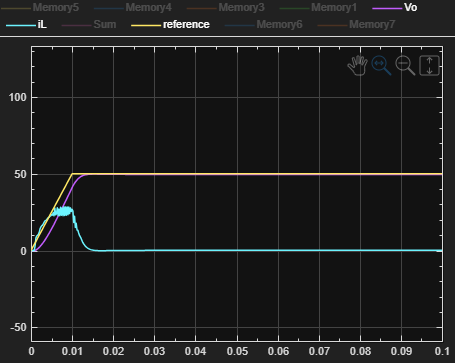

분석: 에이전트가 램프 입력에 따라 오버슈트 없이 출력 전압을 정밀하게 추종함을 확인하였다. 
적분항의 도입으로 정상 상태 오차(Steady-state Error)가 거의 0에 수렴하는 우수한 성능을 보인다.

문제점: 급격한 목표 전압 변경(Step Input)이나 큰 부하 변동 시, 에이전트는 전압 오차를 줄이는 데에만 집중하여 듀티 사이클(Duty Cycle)을 순간적으로 최대로 개방할 수 있다. 
이는 인덕터의 자기 포화(Magnetic Saturation)를 유발하거나, 스위칭 소자의 허용 전류를 초과하는 돌입 전류(Inrush Current)를 발생시킬 위험이 있다.
현상: 시뮬레이션 상에서 급격한 스텝 입력 시 수십~수백 암페어(A)의 피크 전류가 관측될 가능성이 있다. 
(Ramp 입력을 통해 이를 완화하였으나, 근본적인 제어 로직상의 한계임)

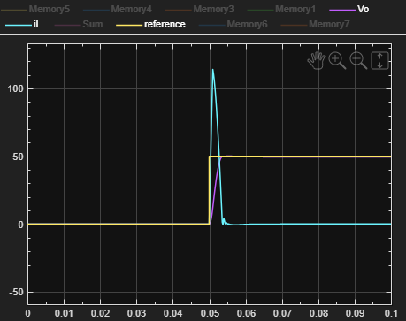

### 2.5. 과도 응답 특성 (45V $\leftrightarrow$ 55V Step Response)
동적인 목표 전압 변경 상황에서의 추종 성능 테스트 결과이다.
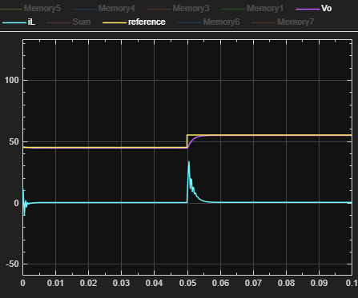
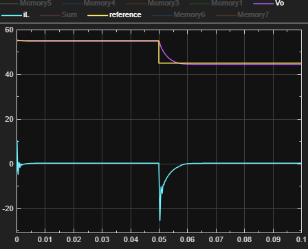

분석: 45V에서 55V로의 상승 구간 및 55V에서 45V로의 하강 구간 모두에서 빠른 정정 시간(Settling Time)을 보여준다. 
특히 진척도 보상($R_{progress}$)의 영향으로 에이전트가 오차 변화율에 민감하게 반응하여 빠른 응답성을 확보하였다.

# 3. [Scenario B] 무부하+중부하

### 3.1. 개요

출력단에 500W($V_{out}=50V, I_{load}=10A$)의 고부하가 걸리는 상황도 추가가 되었다. 
이 조건에서는 기동 시 혹은 부하 변동 시 **대전류(Inrush Current)**가 유입될 위험이 매우 크다. 
단순히 전압만 맞추려다가는 인덕터 포화나 소자 파손으로 이어질 수 있으므로, **'하드웨어 안전성(전류 제한)'**이 추가로 요구된다.

### 3.2. 개선된 보상 함수 (Improved Reward Function)

500W 조건의 안전한 제어를 위해, Scenario A의 기본 함수에 전류 제한(Current Limit) 페널티를 추가하여 보상 함수를 고도화하였다.
전류도 전압과 같이 정규화를 하여 패널티를 부여하였다.
정규화를 위한 제한 전류($iL_{limit}$) 는 논문에 나온대로 24A로 설정하였고 정규화를 위한 최대 전류($iL_{MAX}$)는 30A로 설정하였다.

$$R_{improved} = R_{basic} + \mathbf{R_{current}}$$

전류 제한 항 ($R_{current}$): 인덕터 전류($i_L$)가 안전 한계인 24A를 초과할 경우 작동한다.

$$R_{current} = \begin{cases} -7.0 \times ((Current-iL_{limit}) / {iL_{MAX}})^2 & \text{if } i_L > 24A \\ 0.2 & \text{otherwise} \end{cases}$$

### 3.3. 시나리오 설정

무부하 응답과 중부하 응답을 동시에 처리하는 제어기를 학습시키기 위해 시나리오를 2개로 나누어서 랜덤으로 선택되도록 만들었다.

무부하 시나리오 

$P_{cpl} = 0W, iL = 0, Vo = 0, V_{ref} = 40\leftrightarrow60$ 사이의 랜덤값

중부하 시나리오

$P_{cpl} = 500W, iL = 500/V_o ~,~~V_o = 40\leftrightarrow60 $사이 랜덤값, $V_{ref} = 40\leftrightarrow60$ 사이의 랜덤값

### 3.4. 무부하 응답 특성 ($P_{cpl} = 0W$)

무부하 ($P_{cpl} = 0W$) 일때의 전압 응답 특성이다.

#### 3.4.1 초기 기동 밑 soft start(Vo 0 $\to$ 45)

하드웨어 보호를 위해 목표전압을 ramp입력으로 넣었을때 출력이다.

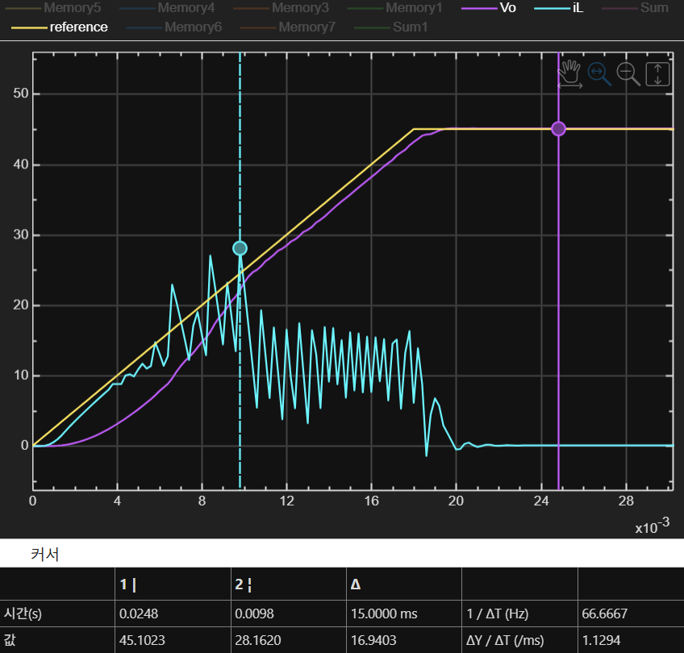

오차는 0.1V로로오차율은 ${{0.1} \over {45}} \times 100\% = 0.22\% $ 로 매우 정밀한 추종을 보여준다.

전류의 overshout는 28A 로 한계 전류에 거의 부합한다.

#### 3.4.2 과도응답 특성 (45V $\leftrightarrow$ 55V)

목표 전압을 ramp입력으로 45V $\leftrightarrow$ 55V 양방향 응답 특성이다.

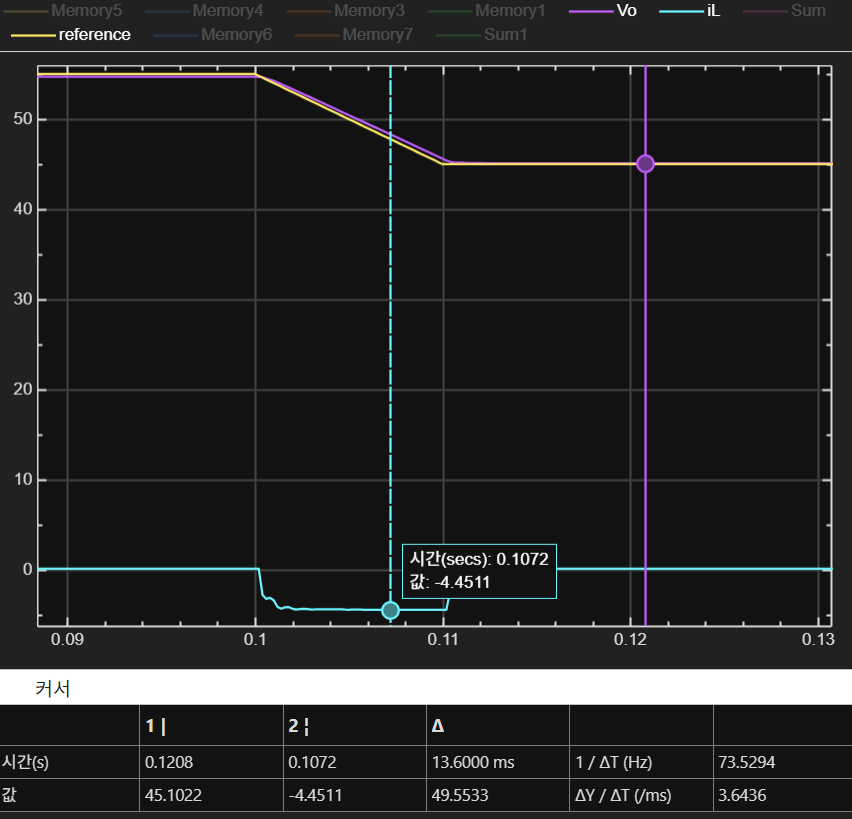
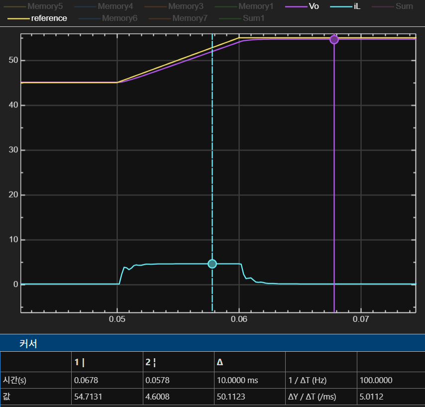

오차는 0.3v로 오차율은율${{0.3} \over {55}} \times 100\% = 0.54\% $ 로 매우 정밀한 추종을 보여준다.

전류의 최대값은 +-4.6A로 전류 margin이 매우 많이 남는다.

### 3.5. 중부하 응답 특성 ($P_{cpl} = 500W $)

중부하($P_{cpl} = 500W$)일때의 응답 특성들이다.

#### 3.5.1 초기 기동 특성

중부하가 $ 0 \to 500W $ ramp 입력으로 걸렸을때의 응답 특성이다.

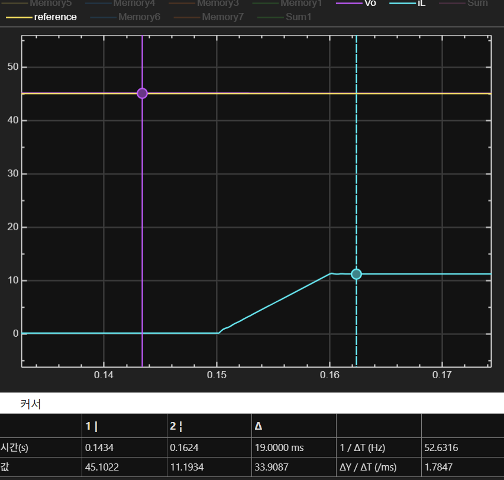

전압은 변동이 없고 전류가 오버슈트나 진동 없이 잘 올라가는 모습이 보여진다. 또한 오른 전류도 11.12A로 목표 전류인 11.11A를 이용한 오차율 ${{0.01} \over {11.11}} \times 100\% = 0.01\% $의 매우 정밀한 추종을 보여준다.

#### 3.5.2 과도응답 특성 (45V $\leftrightarrow$ 55V)

중부하의 경우 목표 전압을 ramp입력으로 45V $\leftrightarrow$ 55V 양방향 응답 특성이다.

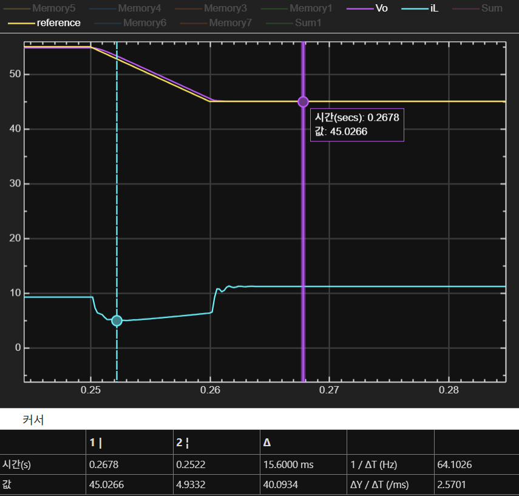
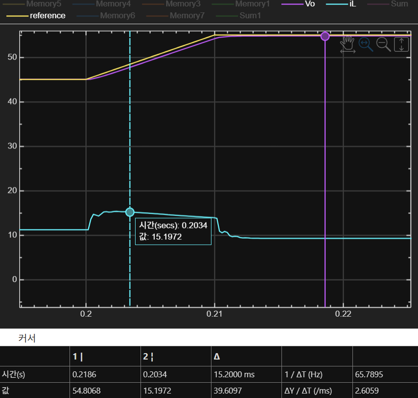

전압 오차는 0.2v로 오차율은율${{0.2} \over {55}} \times 100\% = 0.36\% $ 로 매우 정밀한 추종을 보여준다.

전류의 오버슈트는 +-4.2A로 매우 많은 전류 margine이 있다.

#### 3.5.3 중부하 $\to$ 무부하 응답 특성

$P_{cpl} 500 \to 0W $ 일때의 응답특성이다.

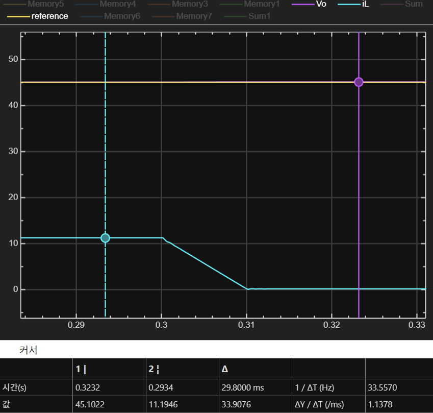

전압의 변동은 없고 전류도 다시 0A로 돌아가는 것을 볼 수 있다.

# 4. PI 제어기와의 비교

## 4.1. PI 제어기 설계

논문에 나온 대로 전압/전류용 pi제어기를 각각 넣었다. pi 계수는 다음과 같다.

전압 P: 4.26, I: 56.73

전류 P: 0.00782, I: 1.6145

## 4.2. PI제어기의 전체 응답


다음은 PI제어기의 전체적인 응답 특성이다.

## 4.3. DDPG 제어기의 전체 응답

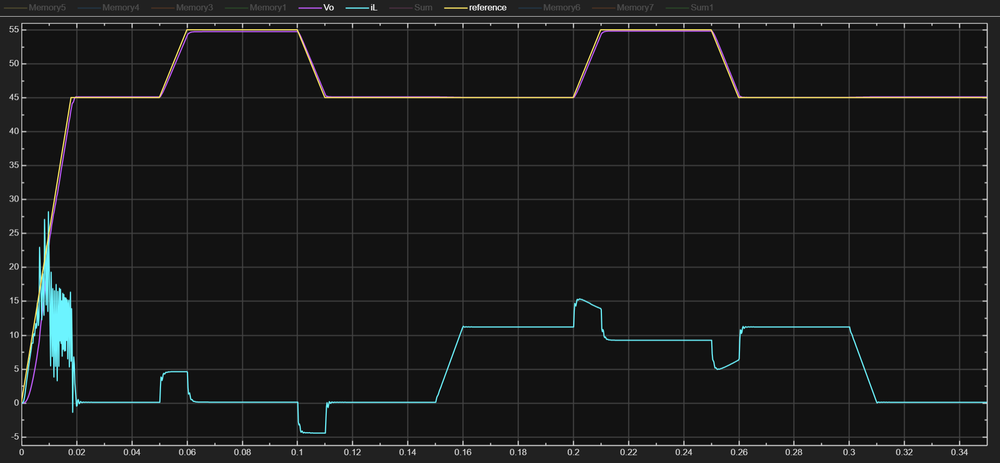
다음은 DDPG 강화학습을 통한 제어기의 전체적인 응답 특성이다.

## 4.4. 비교

DDPG 강화학습을 통한 제어기의 전압 추종 성능과 전류 제어 부분에서 성능 모두 PI제어기 보다 월등히 뛰어나다는 것을 볼 수 있다.

# 5. 보상함수 코드

## 5.1. [Scenario A]
```matlab
function [r, next_int_error, next_prev_error] = RewardFcn(x, prev_vals)
%#codegen
% x(7): Voltage Error (Vref - Vo)
% prev_vals(1): 이전 스텝의 누적 에러 (Integral Error)
% prev_vals(2): 이전 스텝의 전압 에러 (Previous Error)

    %% 1. 파라미터 및 상태 추출
    V_ERR_TOLERANCE = 5;  % 허용 가능한 오차 범위 (예: 0.5V)
    MAX_INT_ERROR = 100;    % 적분항이 무한대 발산하지 않도록 제한
    
    current_error = x(7);
    current_error_abs = abs(current_error);
    
    prev_int_error = prev_vals(1);
    prev_error_abs = prev_vals(2);

    %% 2. 적분 에러 계산 (전략 1: 국소 최적점 타파의 핵심)
    % 오차가 허용 범위보다 크면 적분항을 계속 쌓음
    if current_error_abs > V_ERR_TOLERANCE
        % 오차의 크기만큼 누적 (큰 오차면 더 빨리 쌓임)
        new_int_error = prev_int_error + (current_error_abs * 0.1); 
    else
        % 오차가 거의 없으면 적분항을 리셋 (잘하고 있으니 짐을 덜어줌)
        new_int_error = prev_int_error * 0.9;
    end
    
    % 누적값 포화 (발산 방지)
    new_int_error = min(new_int_error, MAX_INT_ERROR);

    %% 3. 보상 계산
    
    % (1) 기본 에러 페널티 (Quadratic)
    r_error = -5.0 * (current_error_abs / 60)^2; 
    
    % (2) 적분 페널티 (시간이 지날수록 고통 증가)
    % 국소 최적점에 머무르면 이 값이 점점 커져서 결국 움직이게 만듦
    r_integral = -2.5 * (new_int_error / MAX_INT_ERROR)^2;
    
    % (3) 진척도 보너스 (전략 2: 개선 보상)
    % 오차가 줄어들었으면 보너스(+), 늘어났으면 페널티(-)
    % 움직이는 방향(Gradient)을 알려줌
    diff_error = prev_error_abs - current_error_abs;
    r_progress = 10.0 * diff_error; 

    %% 4. 최종 보상 합산
    r = r_error + r_integral + r_progress;
    
    %% 5. 다음 스텝을 위한 변수 리턴
    next_int_error = new_int_error;
    next_prev_error = current_error_abs;

end
```

## 5.2. [Scenario B]

```matlab
function [r, next_int_error, next_prev_error] = RewardFcn(x, prev_vals)
%#codegen
% x(5): iL
% x(7): Voltage Error (Vref - Vo)
% prev_vals(1): 이전 스텝의 누적 에러 (Integral Error)
% prev_vals(2): 이전 스텝의 전압 에러 (Previous Error)

    %% 1. 파라미터 및 상태 추출
    V_ERR_TOLERANCE = 2;  % 허용 가능한 오차 범위 (예: 0.5V)
    MAX_INT_ERROR = 100;    % 적분항이 무한대 발산하지 않도록 제한
    
    current_error = x(7);
    current_error_abs = abs(current_error);
    
    prev_int_error = prev_vals(1);
    prev_error_abs = prev_vals(2);

    iL_abs = abs(x(5));
    I_L_MAX = 30;
    I_L_LIMIT = 24.0; 

    %% 2. 적분 에러 계산 (전략 1: 국소 최적점 타파의 핵심)
    % 오차가 허용 범위보다 크면 적분항을 계속 쌓음
    if current_error_abs > V_ERR_TOLERANCE
        % 오차의 크기만큼 누적 (큰 오차면 더 빨리 쌓임)
        new_int_error = prev_int_error + (current_error_abs * 0.1); 
    else
        % 오차가 거의 없으면 적분항을 리셋 (잘하고 있으니 짐을 덜어줌)
        new_int_error = prev_int_error * 0.9;
    end
    
    % 누적값 포화 (발산 방지)
    new_int_error = min(new_int_error, MAX_INT_ERROR);

    if current_error_abs < 0.5         
        raw_bonus = 1.0 / (current_error_abs + 0.01); % 최대 100점
        r_error = 10 + min(raw_bonus, 50); % 아무리 잘해도 60점을 넘지 않게 제한
        
    elseif current_error_abs < 2.0
        % 오차가 2V 미만이면 적당한 점수
        r_error = 1.0 - (current_error_abs / 2.0); % 정규화하여 0~1 사이 점수
    else
        % 그 밖에는 페널티
        r_error = -1.0 * current_error_abs; % 오차만큼 감점
    end

    % (2) 적분 페널티 (시간이 지날수록 고통 증가)
    % 국소 최적점에 머무르면 이 값이 점점 커져서 결국 움직이게 만듦
    r_integral = -2.5 * (new_int_error / MAX_INT_ERROR)^2;
    
    % (3) 진척도 보너스 (전략 2: 개선 보상)
    % 오차가 줄어들었으면 보너스(+), 늘어났으면 페널티(-)
    % 움직이는 방향(Gradient)을 알려줌
    diff_error = prev_error_abs - current_error_abs;
    r_progress = 10.0 * diff_error; 

    %(4) 전류 패널티
    if iL_abs > I_L_LIMIT
        % 위반 시: 카운트 증가
       
        i_overshoot = (iL_abs - I_L_LIMIT) / I_L_MAX; 
        r_current = -7.0 * (i_overshoot^2);
    else
        % 정상 시: 카운트 감소 (회복)
        r_current = 0.2;
    end

    %% 4. 최종 보상 합산
    r = r_error + r_integral + r_progress + r_current;
    
    %% 5. 다음 스텝을 위한 변수 리턴
    next_int_error = new_int_error;
    next_prev_error = current_error_abs;

end
```
